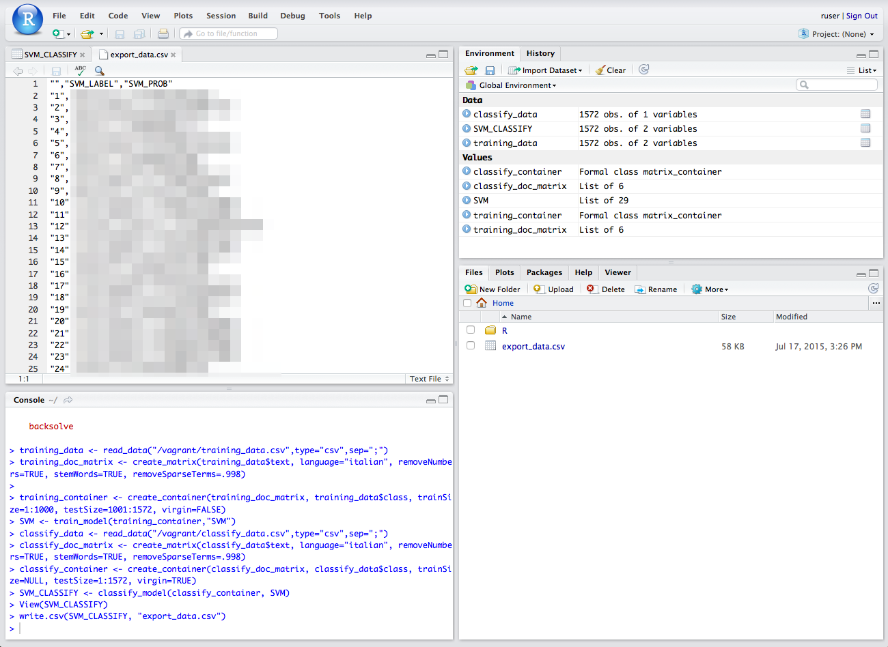

RStudio for Sandstorm
=====================

The intent of this package is to be an example to build your own RStudio / Shiny app for Sandstorm.

The package is done with [vagrant-spk](https://github.com/sandstorm-io/vagrant-spk), a tool designed to help app developers package apps for [Sandstorm](https://sandstorm.io).

You can follow the following steps to make your own package or to contribute.

## Prerequisites

You will need to install:
- [Vagrant](https://www.vagrantup.com/)
- [VirtualBox](https://www.virtualbox.org/wiki/Downloads)
- Git

## Step by Step

    git clone https://github.com/sandstorm-io/vagrant-spk
    git clone https://github.com/JamborJan/rstudio-sandstorm
    export PATH=$(pwd)/vagrant-spk:$PATH
    cd rstudio-sandstorm
    vagrant-spk vm up
    vagrant-spk dev

This version of the app is not yet usable via [http://local.sandstorm.io:6080/](http://local.sandstorm.io:6080/).

Note: when you want to fork this repo and create actual app packages for the app store you would need either the original app key or create a new one and make your own app.

When you build your app
=======================

You can share files between the host box's repository folder and guest box's ```/opt/app``` folder.

To test stuff it makes sense to not stop the services in ```setup.sh``` and use them via ports described in ```Vagrantfile```. This is currently the case and you can access the services without starting an app instance:

RStudio: visit [http://localhost:8787](http://localhost:8787/) in a web browser & login with:

    login: ruser
    password: ruser

You can run this to start a Shiny Test app:

```
if (!require('shiny')) install.packages("shiny")
shiny::runGitHub("shiny-examples", "rstudio", subdir = "001-hello")
```

Shiny Server: visit [http://localhost:3838](http://localhost:3838/) in a web browser.

Classifiaction of text snippets
===============================
This example shows how to train and use a classifier for short text snippets e.g. customer feedbacks from a survey.

Ensure that the RTextTools Package is enabled (bottom left side of the main window the 3rd tab).



1. Create a CSV file

	You will need to use a CSV file. We linked the repos base path to /vagrant in the vagrant box. So you can copy your CSV file in the repos base path to access it within the box. For this test you can use a file with two columns: "class" and "text". The text column obviously contains your texts which you want to analyze. The class column will be used for two things later: first we want to train our algorithm with manually pre-classifyed data. When this is done our algorithm can classify data on it's own and will write the class it finds here. So for now we need a file where both columns are filled in.

	Ensure you save your text file with UTF8 encoding. This is a common problem when creating your files from Microsoft Excel.

2. Read the training CSV file

	You can read your CSV file with the ```read_data```function into the ```data``` object. Ensure to enter the right name of your file and the right delimiter e.g. semicolon or the pipe symbol.

	```
	training_data <- read_data("/opt/app/example_data/classification/training_data.csv",type="csv",sep=";")
	```

3. Process your file

	Now you can process your data. It would be ridiculous to believe I can describe in this small README how you should do text analytics, you need to know what you do or should grab a book and study. So I do only one thing here: I show the commands explained in the [quick guide of RTextTools](http://journal.r-project.org/archive/2013-1/collingwood-jurka-boydstun-etal.pdf) so that you can quickly run through the steps and see the result.

	First we create a document matrix. Note: ```training_data$text``` is the name of the object where you have imported your data before and the column name you want to analyze. You can set also a language. The other options are copy & paste from the quick start guide.

	```
	training_doc_matrix <- create_matrix(training_data$text, language="english", removeNumbers=TRUE, stemWords=TRUE, removeSparseTerms=.998)
	```

	Now we create a container from that. The matrix is referenced. Again we see ```training_data$class``` which references your data and a column labeling your text and thus classifying it. ```trainSize=1:20``` means the first 1'000 lines will be used for training and ```testSize=21:30``` means these lines will be used for verifying. ```virgin=FALSE```indicates that we are dealing with pre-classifyed data.

	```
	training_container <- create_container(training_doc_matrix, training_data$class, trainSize=1:20, testSize=21:30, virgin=FALSE)
	```

	There are several algorithms available, for pros and cons I refer to my previous statement: buy books and study :-) I only show one example with a simple algorithm from the [quick guide from the RTextTools](http://journal.r-project.org/archive/2013-1/collingwood-jurka-boydstun-etal.pdf) guys. So we use the support vector machine algorithm (SVM).

	```
	SVM <- train_model(training_container,"SVM")
	```
	And now it is getting interesting :-)

4. Read the CSV file for classifying and pre process it
	Same as before for the training. Now we have a CSV with only one column "text".

	```
	classify_data <- read_data("/opt/app/example_data/classification/classify_data.csv",type="csv",sep=";")
	```
	Now we do the matrix again:
	```
	classify_doc_matrix <- create_matrix(classify_data$text, language="english", removeNumbers=TRUE, stemWords=TRUE, removeSparseTerms=.998)
	```

	and the container but this time we have a virgin file. So ```trainSize```is null and ```testSize```is all.

	```
	classify_container <- create_container(classify_doc_matrix, classify_data$class, trainSize=NULL, testSize=1:4, virgin=TRUE)
	```

5. Classify data
	Now you run the trained classifyer ```SVM```with your data.
	```
	SVM_CLASSIFY <- classify_model(classify_container, SVM)
	```
	And you get as a result the label for every single line with a probabilty that the result is right.
	```
	View(SVM_CLASSIFY)
	```

6. Export data
	As I am running out of time right now I couldn't make this smoother.

	You can export the file from RStudio to the firtual machine
	```
	write.csv(SVM_CLASSIFY, "export_data.csv")
	```
	Then open the files section (first tab on the bottom right part of the main screen). You see the file there and can click on it. It is displayed in the upper left part of the main screen and you can copy and past the content.

	Merging the results with original texts must be done manually so far. I have to check that in detail later.

Using deep learning algorithms
==============================
This example shows how to use deep learning algorithms to analyze long texts.

Ensure that the deepnet Package is enabled (bottom left side of the main window the 3rd tab).

... examples will follow ...

Pending tasks
=============
See https://github.com/JamborJan/rstudio-sandstorm/issues
